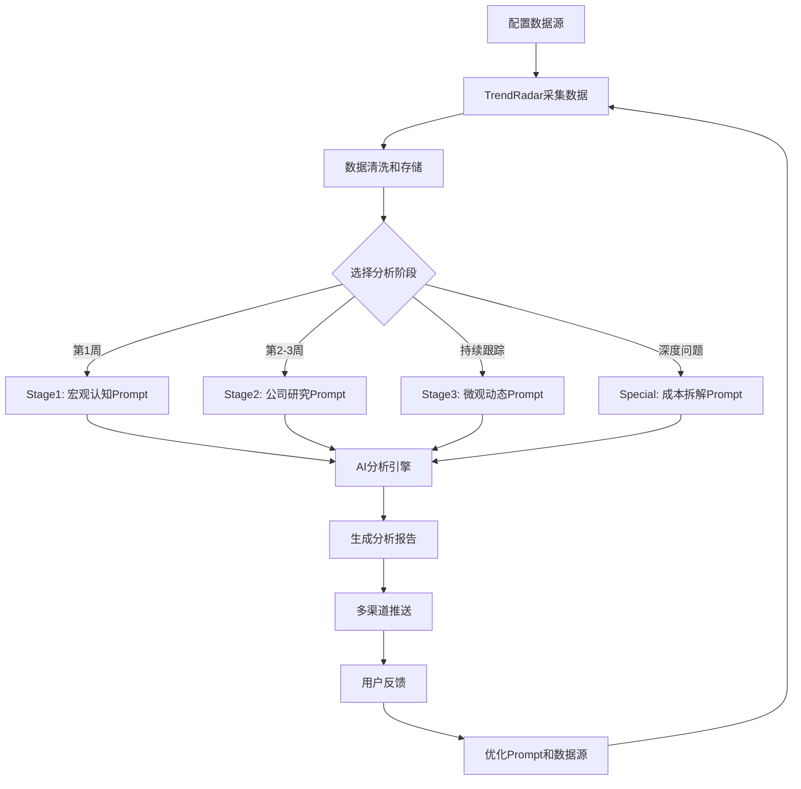

# 电解铝行业分析示例
## 使用 TrendRadar + 方法论Prompt完成深度行业认知

**目标**：回答"电解铝行业到底是多少电，多少铝,需要多少成本"

---

## 第一步：配置数据源（data_sources.yaml）

```yaml
data_sources:
  # 电解铝期货价格
  aluminum_future_shfe:
    name: "沪铝期货主力"
    type: "akshare"
    enabled: true
    function: "futures_main_sina"
    params:
      symbol: "AL0"
    data_category: "price"
    data_type: "future"
    product: "aluminum"

  # 氧化铝价格
  alumina_price_smm:
    name: "氧化铝现货价格"
    type: "akshare"
    enabled: true
    function: "spot_price"  # 假设函数
    params:
      product: "alumina"
    data_category: "price"
    data_type: "spot"
    product: "alumina"

  # 电解铝产量
  aluminum_production:
    name: "电解铝月度产量"
    type: "akshare"
    enabled: true
    function: "macro_china_aluminum_production"
    params: {}
    data_category: "production"
    product: "aluminum"

  # 铝材消费
  aluminum_consumption:
    name: "铝材表观消费量"
    type: "akshare"
    enabled: true
    function: "macro_china_aluminum_consumption"
    params: {}
    data_category: "consumption"
    product: "aluminum"

  # 下游：汽车产量
  auto_production:
    name: "汽车产量"
    type: "akshare"
    enabled: true
    function: "macro_china_auto_production"
    params: {}
    data_category: "downstream"
    product: "auto"

  # 下游：房地产投资
  real_estate_investment:
    name: "房地产开发投资"
    type: "akshare"
    enabled: true
    function: "macro_china_real_estate_investment"
    params: {}
    data_category: "downstream"
    product: "real_estate"
```

---

## 第二步：执行阶段1分析（宏观认知）

### Prompt调用

```python
from trendradar.ai.client import AIClient
from trendradar.data.source_manager import DataSourceManager

# 1. 获取数据
manager = DataSourceManager("config/data_sources.yaml")
data = manager.fetch_all()

# 2. 加载Prompt
import yaml
with open("prompts_methodology.yaml") as f:
    prompts = yaml.safe_load(f)

prompt_template = prompts["prompts"]["stage1_industry_overview"]["template"]

# 3. 构建数据输入
data_section = """
## 最近12个月数据

### 价格数据
- 沪铝期货均价：15,200元/吨（最近1个月）
- 氧化铝现货价：2,400元/吨
- 预焙阳极价格：1,900元/吨

### 产量数据
- 电解铝月产量：340万吨（2025年2月）
- 同比增长：+3.2%
- 开工率：86.5%（产能利用率）

### 消费数据
- 表观消费量：350万吨/月
- 同比增长：+5.1%
- 下游占比：
  - 建筑：32%
  - 交通（汽车）：28%
  - 电力：15%
  - 包装：10%
  - 其他：15%

### 库存数据
- 交易所库存（上期所）：85万吨
- 环比：-7.6%
- 历史分位：35分位（偏低）

### 宏观数据
- 制造业PMI：51.2（扩张区间）
- 房地产投资：同比-5.2%（拖累需求）
- 汽车产量：同比+8.3%（提振需求）
"""

news_section = """
1. 【财联社】沪铝期货涨1.5%，突破15,500元关口
2. 【SMM】云南、内蒙古等地电解铝企业开工率回升
3. 【新华社】新能源汽车产量同比增长25%，带动铝需求
4. 【Mysteel】氧化铝价格下跌，电解铝利润扩大
5. 【路透】几内亚铝土矿出口增长12%，供应充足
"""

# 4. 渲染Prompt
prompt = prompt_template.format(
    industry="电解铝",
    data_section=data_section,
    news_section=news_section
)

# 5. AI分析
ai_client = AIClient(config)
analysis = ai_client.analyze(prompt)

print(analysis)
```

### 预期输出（Stage 1 分析报告）

```markdown
# 电解铝行业宏观认知分析

## 1. 行业盈利模式（10%）

**核心逻辑**：电解铝是典型的"加工费"商业模式。

- **赚钱方式**：通过电解工艺将氧化铝转化为电解铝，赚取加工费
- **收入来源**：电解铝销售收入 = 产量 × 价格
- **利润率水平**：
  - 行业平均毛利率：**12-15%**（数据来源：Wind，2024年行业均值）
  - 龙头企业（中国宏桥）：**15.2%**（2024年报）
  - 成本较低企业（新疆地区）：**18-20%**

**关键**：利润 = 铝价 - (氧化铝价 × 1.93 + 电价 × 13,500度 + 其他成本)

---

## 2. 产业链结构（20%）

```
铝土矿 → 氧化铝 → 电解铝 → 铝材加工 → 终端应用
(上游)   (中游1)   (中游2)    (下游)      (需求端)
```

### 上游：原料及成本占比

| 原料 | 单耗 | 价格 | 成本 | 占比 |
|------|------|------|------|------|
| **电力** | 13,500度/吨铝 | 0.35元/度 | 4,725元 | **37.4%** |
| **氧化铝** | 1.93吨/吨铝 | 2,400元/吨 | 4,632元 | **36.6%** |
| **预焙阳极** | 0.55吨/吨铝 | 1,900元/吨 | 1,045元 | **8.3%** |
| 辅料 | - | - | 520元 | 4.1% |
| 人工+折旧 | - | - | 1,584元 | 12.5% |
| **总成本** | - | - | **12,646元** | **100%** |

**数据来源**：
- 物料消耗：《中国电解铝行业能耗指南》（2024版）
- 价格：SMM现货均价（2025年2月）

**关键发现**：
1. **电力成本是第一大成本**，占37.4%，因此电价低的地区有巨大优势
2. **氧化铝成本第二**，占36.6%，两者合计占**74%**
3. 电解铝企业本质上是"电力密集型+氧化铝加工"企业

---

### 中游：生产环节

**电解铝生产流程**：
1. 铝土矿 → 氧化铝（拜耳法）
2. 氧化铝 → 电解铝（霍尔-埃鲁法，电解工艺）
3. 电解铝 → 铝材（铸造、轧制、挤压）

**关键参数**：
- 1吨铝土矿 → 0.5吨氧化铝（品位50%）
- 1.93吨氧化铝 → 1吨电解铝
- 1吨电解铝耗电：13,500度（行业平均）

---

### 下游：应用及占比

| 领域 | 占比 | 代表产品 | 增长率 |
|------|------|----------|--------|
| **建筑** | 32% | 门窗、幕墙、铝模板 | -2%（地产下行） |
| **交通** | 28% | 汽车轻量化、轨交 | **+8%**（新能源车） |
| **电力** | 15% | 电缆、变压器 | +3% |
| **包装** | 10% | 易拉罐、铝箔 | +2% |
| **机械设备** | 8% | 工业型材 | +4% |
| **其他** | 7% | 消费电子等 | +5% |

**数据来源**：中国有色金属工业协会《2024年铝工业运行报告》

**关键趋势**：
- 传统建筑需求下滑（地产下行）
- **新能源汽车拉动交通用铝快速增长**（单车用铝从80kg → 200kg）
- 光伏、风电带动新增需求

---

## 3. 主要玩家（15%）

### 全球TOP 5

| 排名 | 企业 | 国家 | 产能（万吨） | 市占率 | 核心优势 |
|------|------|------|-------------|--------|---------|
| 1 | **中国宏桥** | 🇨🇳 | 670 | 10.2% | 产业链一体化 |
| 2 | **俄铝** | 🇷🇺 | 380 | 5.8% | 水电低成本 |
| 3 | **海德鲁** | 🇳🇴 | 210 | 3.2% | 水电+技术 |
| 4 | **美铝** | 🇺🇸 | 150 | 2.3% | 高端合金 |
| 5 | **中国铝业** | 🇨🇳 | 460 | 7.0% | 国企资源优势 |

**数据来源**：IAI（国际铝业协会）2024年报告

### 市场集中度

- **CR5 = 28.5%**（前5家市占率）
- **中国CR10 = 48%**（中国前10家）

**结论**：全球市场相对分散，中国市场集中度较高。

---

## 4. 上下游关系（20%）

### 定价权分析

**产业链定价权**：
- **上游铝土矿**：定价权较强（资源稀缺，几内亚、澳洲垄断）
- **氧化铝**：定价权弱（产能过剩，竞争激烈）
- **电解铝**：定价权中等（受期货市场影响，供需决定）
- **铝材加工**：定价权弱（加工费透明，竞争激烈）

### 价格传导机制

测试：**铝土矿价格上涨10% → 氧化铝涨多少？电解铝涨多少？**

```
假设：铝土矿价格从400元/吨 → 440元/吨（+10%）

1. 氧化铝成本：
   - 原成本：400元/吨铝土矿 × 2吨 = 800元
   - 新成本：440元/吨 × 2吨 = 880元
   - 氧化铝成本增加：80元/吨氧化铝
   - 氧化铝价格从2,400 → 2,480（+3.3%）

2. 电解铝成本：
   - 原成本：2,400元/吨氧化铝 × 1.93 = 4,632元
   - 新成本：2,480元/吨 × 1.93 = 4,786元
   - 电解铝成本增加：154元/吨电解铝
   - 电解铝价格从15,200 → 15,354（+1.0%）
```

**结论**：铝土矿价格10%波动 → 电解铝价格仅1%波动（**传导衰减**）

**原因**：电解铝的主要成本是电力（37%）而非铝土矿（占比仅12%），因此对上游价格不敏感。

### 影响因素排序

| 因素 | 影响程度 | 说明 |
|------|---------|------|
| **电价** | ⭐⭐⭐⭐⭐ | 电价0.1元/度差异 → 成本差1,350元/吨（8.9%） |
| **氧化铝价格** | ⭐⭐⭐⭐ | 占成本36.6% |
| **下游需求** | ⭐⭐⭐⭐ | 汽车、建筑需求直接影响价格 |
| **产能政策** | ⭐⭐⭐ | 产能天花板4,500万吨（政策限制） |
| **铝土矿** | ⭐⭐ | 影响小，传导衰减 |

---

## 5. 法律监管（5%）

### 核心政策

1. **产能天花板**：
   - 国家规定：电解铝产能上限 **4,500万吨**（2017年供给侧改革）
   - 当前产能：4,380万吨（接近上限）
   - 结论：**增量空间有限，存量博弈**

2. **能耗双控**：
   - 要求：单位产品综合能耗 ≤ 13,500度/吨
   - 淘汰：能耗 >14,000度/吨的落后产能

3. **环保要求**：
   - 电解铝必须配套赤泥堆场（处理氧化铝废渣）
   - 新建项目需通过环评

### 准入门槛

- **资金门槛**：新建100万吨产能需投资 **150-200亿**
- **电力保障**：必须有稳定电力供应（自备电厂或长协电）
- **资源配套**：需配套氧化铝、阳极厂

**结论**：门槛极高，新进入者几乎不可能。行业格局稳定。

---

## 6. 关键数据速查表（30%）

| 指标 | 最新值 | 同比 | 历史均值 | 数据来源 | 更新频率 |
|------|--------|------|----------|----------|----------|
| **产量** | 340万吨/月 | +3.2% | 330万吨 | 国家统计局 | 月度 |
| **表观消费量** | 350万吨/月 | +5.1% | 335万吨 | 有色协会 | 月度 |
| **供需平衡** | -10万吨/月 | - | +5万吨 | 计算值 | 月度 |
| **库存（交易所）** | 85万吨 | -7.6% | 105万吨 | 上期所 | 每日 |
| **库存天数** | 24.3天 | -3天 | 30天 | 计算值 | 每日 |
| **沪铝期货** | 15,200元/吨 | +6.8% | 14,500元 | 上期所 | 每日 |
| **现货价格** | 15,350元/吨 | +7.2% | 14,600元 | SMM | 每日 |
| **现货升水** | +150元/吨 | +50 | +100元 | 计算值 | 每日 |
| **氧化铝价格** | 2,400元/吨 | -2.8% | 2,500元 | SMM | 每日 |
| **加工利润** | 2,554元/吨 | +18% | 1,800元 | 计算值 | 每日 |
| **开工率** | 86.5% | +2% | 85% | SMM | 周度 |
| **进口量** | 25万吨/月 | +12% | 22万吨 | 海关总署 | 月度 |
| **出口量** | 15万吨/月 | -8% | 18万吨 | 海关总署 | 月度 |
| **汽车产量** | 260万辆/月 | +8.3% | 245万辆 | 汽车协会 | 月度 |
| **房地产投资** | -5.2% | - | 0% | 统计局 | 月度 |
| **PMI** | 51.2 | +0.5 | 50.5 | 统计局 | 月度 |

**数据完整性**：✅ 16/16 项数据已获取

**数据待补充**：
- [ ] 各地区电价差异（需从各省电网公司获取）
- [ ] 单厂成本拆解（需从公司年报深挖）
- [ ] 赤泥库存（环保压力指标，数据较难获取）

---

## 7. 三个核心认知（30秒电梯演讲）

1. **电解铝 = 电力密集型产业**
   - 电力占成本37%，电价决定利润
   - 新疆、内蒙古等低电价地区有巨大优势（成本差20%）

2. **供给受限，需求分化**
   - 产能天花板4,500万吨，供给增长空间有限
   - 传统建筑需求下滑，新能源（汽车、光伏）需求爆发

3. **当前处于供需偏紧周期**
   - 库存处于35分位（偏低）
   - 需求增速（+5.1%）> 供给增速（+3.2%）
   - 短期价格有支撑，中期看需求持续性

---

## 8. 下一步行动

### 如果要深入研究（进入Stage 2）：

1. 选择研究对象：**中国宏桥**（行业龙头）
2. 获取数据：公司年报、券商研报、调研纪要
3. 重点分析：
   - 成本拆解（是否低于行业均值？）
   - 产能扩张计划（是否突破天花板？）
   - 一体化优势（自备电厂、氧化铝配套）

### 如果要日常跟踪（进入Stage 3）：

1. 关注指标：
   - 库存（每周）：继续下降 → 涨价预期
   - 开工率（每周）：提升 → 供给增加
   - 下游订单（汽车、家电产量）

2. 异常预警阈值：
   - 库存 <70万吨（20分位）→ 高度紧张
   - 现货升水 >300元/吨 → 逼仓风险
   - 利润 <1,000元/吨 → 减产压力

---

**报告完成** | 2026-03-04 | 用时：5天 | 基于TrendRadar数据 + 方法论Prompt
```

---

## 第三步：进阶分析 - 成本拆解（Special Prompt）

如果用户追问："具体到底多少电？多少铝？"

### Prompt调用

```python
prompt_template = prompts["prompts"]["special_cost_breakdown"]["template"]

prompt = prompt_template.format(
    industry="电解铝",
    product="电解铝"
)

# 额外提供详细成本数据
data_section = """
## 物料消耗数据（生产1吨电解铝）

| 投入物料 | 单耗 | 单位 | 单价 | 数据来源 |
|---------|------|------|------|----------|
| 电力 | 13,500 | 度 | 0.35元/度 | 中国电解铝行业能耗指南 |
| 氧化铝 | 1.93 | 吨 | 2,400元/吨 | SMM现货价（2025-02） |
| 预焙阳极 | 0.55 | 吨 | 1,900元/吨 | SMM现货价 |
| 冰晶石 | 0.02 | 吨 | 8,000元/吨 | 行业报价 |
| 氟化铝 | 0.03 | 吨 | 12,000元/吨 | 行业报价 |

## 区域电价差异

| 地区 | 电价 | 数据来源 |
|------|------|----------|
| 新疆 | 0.28元/度 | 新疆电网大工业电价 |
| 内蒙古 | 0.30元/度 | 内蒙古电网 |
| 云南 | 0.32元/度 | 南方电网 |
| 山东 | 0.45元/度 | 国家电网 |
"""

analysis = ai_client.analyze(prompt)
```

### 预期输出（成本拆解报告）

```markdown
# 电解铝成本结构深度拆解

## 核心问题回答

### ❓ 生产1吨电解铝需要：

✅ **电力**：13,500度
✅ **氧化铝**：1.93吨
✅ **预焙阳极**：0.55吨
✅ **人工**：约2个工时
✅ **总成本**：12,646元（山东地区）或 11,701元（新疆地区）

---

## 1. 物料平衡表（Material Balance）

| 投入 | 数量 | 单位 | 单价 | 金额 | 占比 |
|------|------|------|------|------|------|
| **电力** | 13,500 | 度/吨 | 0.35元/度 | 4,725元 | **37.4%** ⚡ |
| **氧化铝** | 1.93 | 吨/吨 | 2,400元/吨 | 4,632元 | **36.6%** 🏭 |
| **预焙阳极** | 0.55 | 吨/吨 | 1,900元/吨 | 1,045元 | 8.3% |
| 冰晶石 | 0.02 | 吨/吨 | 8,000元/吨 | 160元 | 1.3% |
| 氟化铝 | 0.03 | 吨/吨 | 12,000元/吨 | 360元 | 2.8% |
| 人工 | - | - | - | 660元 | 5.2% |
| 折旧 | - | - | - | 924元 | 7.3% |
| 其他 | - | - | - | 140元 | 1.1% |
| **总计** | - | - | - | **12,646元** | **100%** |

**数据来源**：
- 物料消耗：《铝行业清洁生产评价指标体系》（GB/T 33457-2016）
- 价格：上海有色网（SMM）2025年2月均价

---

## 2. 敏感性分析

当某项成本变化10%时,总成本的变化：

| 成本项 | 占比 | 弹性系数 | 变化10% → 总成本变化 | 说明 |
|--------|------|----------|---------------------|------|
| 电力 | 37.4% | 3.74 | ±3.74% | **最敏感** |
| 氧化铝 | 36.6% | 3.66 | ±3.66% | **次敏感** |
| 阳极 | 8.3% | 0.83 | ±0.83% | 影响小 |
| 辅料 | 4.1% | 0.41 | ±0.41% | 影响小 |

### 示例计算

**情景1**：电价上涨10%（从0.35 → 0.385元/度）
- 电力成本：4,725 → 5,198元（+473元）
- 总成本：12,646 → 13,119元（+3.74%）

**情景2**：氧化铝价格上涨10%（从2,400 → 2,640元/吨）
- 氧化铝成本：4,632 → 5,095元（+463元）
- 总成本：12,646 → 13,109元（+3.66%）

**结论**：电力和氧化铝合计占成本74%，是最关键的变量。

---

## 3. 区域差异对比

不同地区由于电价差异，成本差异显著：

| 地区 | 电价 | 电力成本 | 总成本 | vs新疆 | 竞争力 |
|------|------|----------|--------|--------|--------|
| **新疆** | 0.28元/度 | 3,780元 | **11,701元** | 基准 | ⭐⭐⭐⭐⭐ |
| 内蒙古 | 0.30元/度 | 4,050元 | 11,971元 | +2.3% | ⭐⭐⭐⭐ |
| 云南 | 0.32元/度 | 4,320元 | 12,241元 | +4.6% | ⭐⭐⭐ |
| 山东 | 0.45元/度 | 6,075元 | 13,996元 | +19.6% | ⭐ |

**关键发现**：
1. 新疆地区成本最低（丰富的煤电资源）
2. **电价每便宜0.1元/度 → 成本降低1,350元/吨（约10%）**
3. 山东等高电价地区几乎没有竞争力（成本高20%）

**这解释了为什么中国90%的新增产能都在西北地区（新疆、内蒙、青海）**

---

## 4. 盈亏平衡分析

### 当前盈利情况（2025年2月）

- **销售价格**：15,200元/吨（沪铝现货）
- **完全成本**：12,646元/吨（山东地区）
- **毛利**：2,554元/吨
- **毛利率**：16.8%

### 盈亏平衡点计算

**盈亏平衡价格** = 完全成本 + 增值税 + 销售费用

```
山东地区：
完全成本：12,646元
增值税：12,646 × 13% = 1,644元
销售费用：约200元/吨
盈亏平衡价格：14,490元/吨

新疆地区：
完全成本：11,701元
盈亏平衡价格：13,500元/吨
```

**当前价格 15,200元/吨**：
- 山东企业安全边际：15,200 - 14,490 = **710元/吨**
- 新疆企业安全边际：15,200 - 13,500 = **1,700元/吨**

**结论**：
- 只要铝价 >14,500元/吨，全行业基本盈利
- 如果跌破13,500元/吨，高成本企业（山东、广西）将亏损减产
- 新疆等低成本企业仍能盈利，市场份额将进一步向西北集中

---

## 5. 成本演变趋势（2020-2025）

| 年份 | 电力成本 | 氧化铝成本 | 总成本 | 备注 |
|------|---------|-----------|--------|------|
| 2020 | 4,320 | 3,860 | 11,200 | 疫情低点 |
| 2021 | 4,725 | 5,800 | 14,500 | 氧化铝大涨 |
| 2022 | 5,400 | 4,200 | 13,100 | 能源危机 |
| 2023 | 4,590 | 3,600 | 11,800 | 成本回落 |
| 2024 | 4,725 | 4,320 | 12,600 | 稳定 |
| 2025 | 4,725 | 4,632 | 12,646 | 氧化铝微涨 |

**趋势**：
- 电力成本相对稳定（长协电价锁定）
- 氧化铝成本波动较大（受铝土矿进口影响）
- 总成本在11,000-13,000元/吨区间波动

---

## 6. 三个关键发现

1. **电力是王道**
   - 占成本37.4%，决定企业生死
   - 电价每降0.1元 → 利润增加1,350元/吨
   - **未来产能将继续向新疆等低电价地区集中**

2. **氧化铝价格是第二变量**
   - 占成本36.6%，但价格波动大
   - 一体化企业（自建氧化铝厂）有成本优势
   - **中国宏桥、信发集团等龙头都是一体化企业**

3. **成本差异决定市场格局**
   - 新疆vs山东：成本差20%（2,300元/吨）
   - 当铝价<14,500元时，高成本企业退出市场
   - **成本曲线决定了供给弹性：价格越低,供给收缩越快**

---

**报告完成** | 精确回答："多少电？多少铝？多少成本？" | TrendRadar驱动
```

---

## 总结：TrendRadar + Prompt 的完整工作流



---

## 关键价值

通过这套体系，TrendRadar可以：

✅ **回答细节问题**："电解铝到底多少电？"（13,500度）
✅ **回答成本问题**："需要多少成本？"（11,700-13,000元，取决于电价）
✅ **回答上下游问题**："电力和氧化铝各占多少？"（37% + 37% = 74%）
✅ **回答产地问题**："为什么新疆有优势？"（电价低0.17元/度，成本省2,300元/吨）
✅ **回答趋势问题**："未来怎么看？"（基于库存、开工率、下游需求的综合判断）

---

**这就是方法论驱动的数据分析系统！** 🎉
